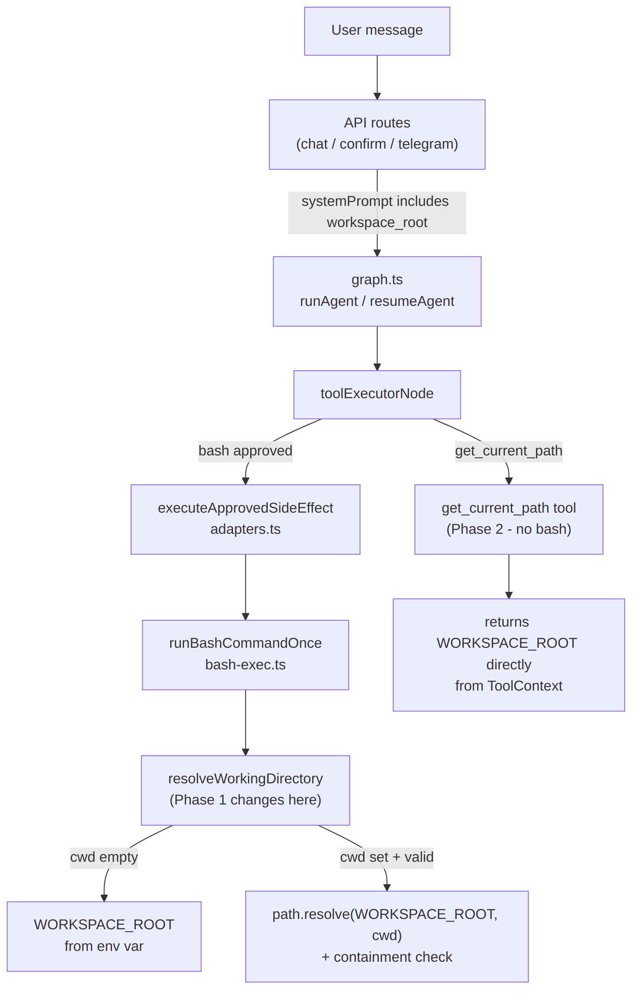

# Workspace CWD Safety — 3-Phase Implementation Plan

## Architecture overview



---

## Phase 1 — Fixed workspace root (non-breaking)

**Files changed:** 4

### [`packages/agent/src/tools/bash-exec.ts`](packages/agent/src/tools/bash-exec.ts)

Replace the `process.cwd()` fallback with a validated module-level constant, resolve relative paths against root, and add a containment guard:

```typescript
// Module-level constant — evaluated once at startup
const WORKSPACE_ROOT = process.env.AGENT_WORKSPACE_ROOT?.trim() || process.cwd();

// Export for startup validation (called from API layer)
export async function validateWorkspaceRoot(): Promise<void> {
  const raw = process.env.AGENT_WORKSPACE_ROOT?.trim();
  if (!raw) return;
  const stat = await fs.stat(raw).catch(() => null);
  if (!stat?.isDirectory()) {
    throw new Error(`AGENT_WORKSPACE_ROOT is not an accessible directory: ${raw}`);
  }
}

async function resolveWorkingDirectory(cwd: string | undefined): Promise<string> {
  if (!cwd || String(cwd).trim() === "") {
    return WORKSPACE_ROOT; // deterministic, no longer process.cwd()
  }
  const resolved = path.resolve(WORKSPACE_ROOT, String(cwd).trim()); // relative → anchored
  // Containment check: prevent escape to /etc, ../../ etc.
  if (!resolved.startsWith(WORKSPACE_ROOT + path.sep) && resolved !== WORKSPACE_ROOT) {
    throw new Error(`cwd escapes workspace root: ${cwd}`);
  }
  const stat = await fs.stat(resolved).catch(() => null);
  if (!stat) throw new Error(`cwd does not exist or is not accessible: ${cwd}`);
  if (!stat.isDirectory()) throw new Error(`cwd is not a directory: ${cwd}`);
  return resolved;
}
```

### [`packages/agent/src/tools/bash-exec.test.ts`](packages/agent/src/tools/bash-exec.test.ts)

Add test cases for:
- empty `cwd` resolves to `WORKSPACE_ROOT` (not arbitrary `process.cwd()`)
- relative `cwd: "src"` resolves to `WORKSPACE_ROOT/src` when it exists
- path escaping (`cwd: "../../etc"`) throws containment error

### Shared system prompt helper — new function in [`packages/agent/src/index.ts`](packages/agent/src/index.ts)

Add and export a `buildSystemPrompt` helper to avoid duplicating injection logic in 4 API route files:

```typescript
export function buildSystemPrompt(base: string): string {
  const root = process.env.AGENT_WORKSPACE_ROOT?.trim();
  if (!root) return base;
  return `${base}\n\nWorkspace root: ${root}`;
}
```

### API routes — inject workspace root into system prompt

Replace the raw `profile?.agent_system_prompt` string with `buildSystemPrompt(...)` in all three routes. Touch points:

- [`apps/web/src/app/api/chat/route.ts`](apps/web/src/app/api/chat/route.ts) — line 108
- [`apps/web/src/app/api/chat/confirm/route.ts`](apps/web/src/app/api/chat/confirm/route.ts) — line 100
- [`apps/web/src/app/api/telegram/webhook/route.ts`](apps/web/src/app/api/telegram/webhook/route.ts) — lines 124 and 391 (both `resumeHitlForTelegramUser` and the main `runAgent` call)

```typescript
import { buildSystemPrompt } from "@agents/agent";
// ...
systemPrompt: buildSystemPrompt((profile?.agent_system_prompt as string) ?? "Eres un asistente útil."),
```

---

## Phase 2 — `get_current_path` tool (additive, no breaking changes)

**Files changed:** 3 + 1 Supabase migration

### [`packages/agent/src/tools/catalog.ts`](packages/agent/src/tools/catalog.ts)

Add a new entry to `TOOL_CATALOG`:

```typescript
{
  id: "get_current_path",
  name: "get_current_path",
  description:
    "Returns the agent's workspace root and effective working directory. " +
    "Use this instead of running bash pwd to answer 'what is my current path?'. " +
    "Does not require confirmation and does not execute any shell command.",
  risk: "low",
  parameters_schema: { type: "object", properties: {}, required: [] },
},
```

### [`packages/agent/src/tools/adapters.ts`](packages/agent/src/tools/adapters.ts)

Add the LangChain tool implementation inside `buildLangChainTools`, after the `get_user_preferences` block:

```typescript
if (isToolAvailable("get_current_path", ctx)) {
  tools.push(
    tool(
      async () => {
        const record = await createToolCall(ctx.db, ctx.sessionId, "get_current_path", {}, false);
        const workspaceRoot = process.env.AGENT_WORKSPACE_ROOT?.trim() || process.cwd();
        const result = {
          workspace_root: workspaceRoot,
          current_directory: workspaceRoot, // Phase 3 will replace with ctx.currentDirectory
        };
        await updateToolCallStatus(ctx.db, record.id, "executed", result);
        return JSON.stringify(result);
      },
      {
        name: "get_current_path",
        description: "Returns the agent's workspace root and effective working directory.",
        schema: z.object({}),
      }
    )
  );
}
```

### Supabase migration — seed `user_tool_settings`

New migration file `packages/db/supabase/migrations/00002_seed_get_current_path_tool.sql`:

```sql
-- Insert get_current_path into user_tool_settings for all existing users
-- Uses ON CONFLICT DO NOTHING to be idempotent
INSERT INTO public.user_tool_settings (user_id, tool_id, enabled)
SELECT id, 'get_current_path', true
FROM public.profiles
ON CONFLICT (user_id, tool_id) DO NOTHING;
```

New users get the tool automatically via the existing `handle_new_user` trigger pattern (or you add a separate trigger — either works).

---

## Phase 3 — Session-level `currentDirectory` in graph state (optional)

**Files changed:** 3

This phase only makes sense if the agent needs genuine multi-turn shell navigation. Its main value is that `get_current_path` returns a live per-session value instead of always reporting `WORKSPACE_ROOT`.

### [`packages/agent/src/graph.ts`](packages/agent/src/graph.ts)

Add `currentDirectory` to `GraphState` with a safe default so existing LangGraph checkpoints (which lack the field) continue to work:

```typescript
const GraphState = Annotation.Root({
  messages: Annotation<BaseMessage[]>({ ... }),
  currentDirectory: Annotation<string>({
    default: () => process.env.AGENT_WORKSPACE_ROOT?.trim() || process.cwd(),
    reducer: (prev, next) => next ?? prev, // undefined from old checkpoints → keep prev
  }),
  sessionId: Annotation<string>(),
  userId: Annotation<string>(),
  systemPrompt: Annotation<string>(),
});
```

Pass `currentDirectory` into `ToolContext` via `buildToolContext`:

```typescript
function buildToolContext(input: ...): ToolContext {
  return {
    ...
    currentDirectory: input.currentDirectory,
  };
}
```

### [`packages/agent/src/tools/adapters.ts`](packages/agent/src/tools/adapters.ts)

Add `currentDirectory` to `ToolContext`:

```typescript
export interface ToolContext {
  ...
  currentDirectory: string;
}
```

Add `change_directory` tool to `buildLangChainTools` — this is the only way the session cwd mutates (avoids parsing bash stdout):

```typescript
// risk: "low" — only validates a path, updates in-memory state, no shell
{
  id: "change_directory",
  name: "change_directory",
  description: "Changes the agent's current working directory for this session.",
  risk: "low",
  parameters_schema: {
    type: "object",
    properties: { path: { type: "string" } },
    required: ["path"],
  },
}
```

Update `get_current_path` to read `ctx.currentDirectory` instead of the env var directly.

Update `executeApprovedSideEffect` bash branch to use `ctx.currentDirectory` as the default `cwd` when none is supplied by the LLM.

---

## Delivery order and risks

- Phase 1 and 2 are independently deployable and independently testable.
- Phase 3 requires setting `AGENT_WORKSPACE_ROOT` before deployment (Phase 1 must be live first).
- The LangGraph checkpoint schema change in Phase 3 is backward-compatible because of the `default` + safe `reducer`.
- The Supabase migration in Phase 2 is idempotent (`ON CONFLICT DO NOTHING`).
